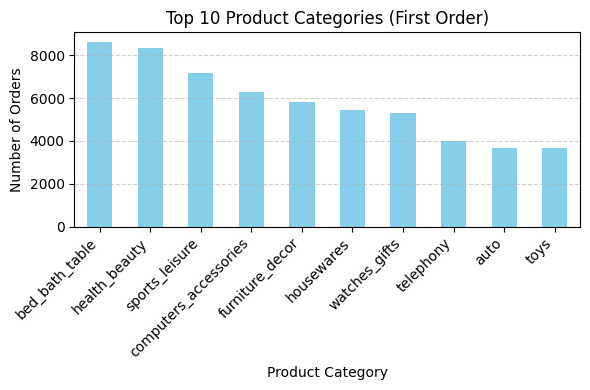
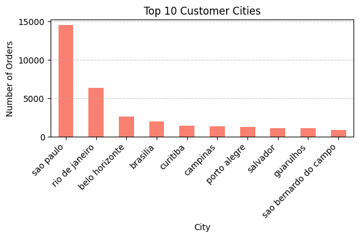

<h1>Olist Repeat Orders Analysis</h1>

<h2>Overview</h2>

Understanding why customers come back is crucial for marketplace growth. This project analyzes repeat orders on Olist to uncover which factors influence customer loyalty and suggests actionable improvements to increase repeat purchases.

<h2>Step 1: What Drives Repeat Orders?</h2>

We looked at key customer and order characteristics such as product categories, sellers, delivery times, order approval times, and customer locations. The analysis revealed that some features are highly influential in predicting whether a customer will make a repeat purchase.

<h3>Top Factors</h3>
<ul>
    <li>Product categories of the first order</li>
    <li>First seller</li>
    <li>Order approval time</li>
    <li>Delivery delay</li>
    <li>Delivery time</li>
</ul>

<h3>Feature Importance</h3>

The chart below shows the most influential factors affecting repeat orders. Product category and first seller dominate, but operational metrics like approval time and delivery speed can still be improved to drive customer loyalty.

<h2>Step 2: Understanding the Market</h2>

Next, we explored the distribution of customers and products to understand the marketplace context.

<h3>Popular Product Categories</h3>

Some product categories appear more frequently in first orders. Knowing this helps focus efforts on the most influential products for repeat purchases.

<h3>Customer Locations</h3>

The geographic distribution of customers shows where the majority of orders come from. This insight can help tailor marketing and operational strategies regionally.

<h2>Step 3: Actionable Insights</h2>

While product categories and sellers are important, the marketplace can directly influence operational metrics. Analysis shows:

<ul>
    <li>Average approval time: 10 hours</li>
    <li>Average delivery delay: -12 days</li>
    <li>Average delivery time: 12 days</li>
</ul>

By reducing order approval time by <strong>50%</strong> and improving delivery speed by <strong>10%</strong>, simulations suggest repeat orders could increase by approximately <strong>9%</strong>.

<h2>Conclusion</h2>

This project combines data exploration, feature analysis, and simple simulation to provide actionable recommendations. Focusing on operational improvements like faster approval and slightly faster delivery, while monitoring product categories and seller distribution, offers a clear path to increasing customer loyalty and repeat purchases.

For more technical details, check <a href="https://github.com/adilrakhimbekov2026-star/olist_repeat_orders_simulation/blob/main/tech_dets.md" target="_blank">this</a>.
