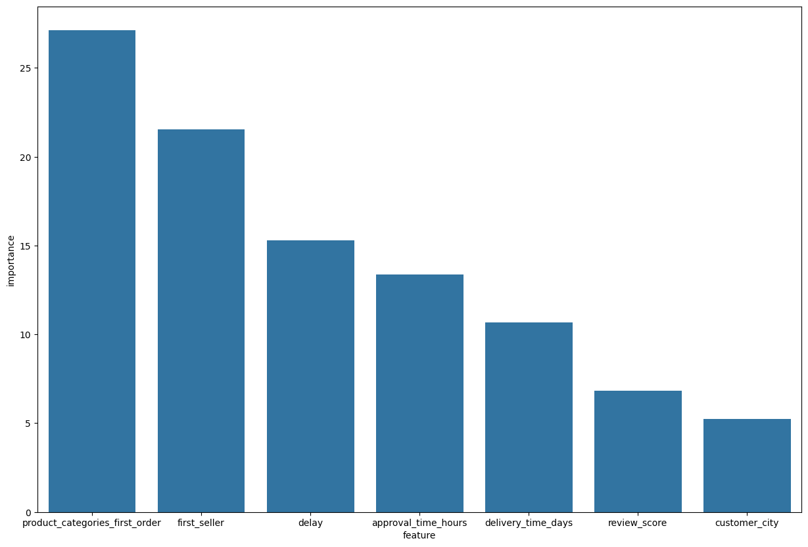
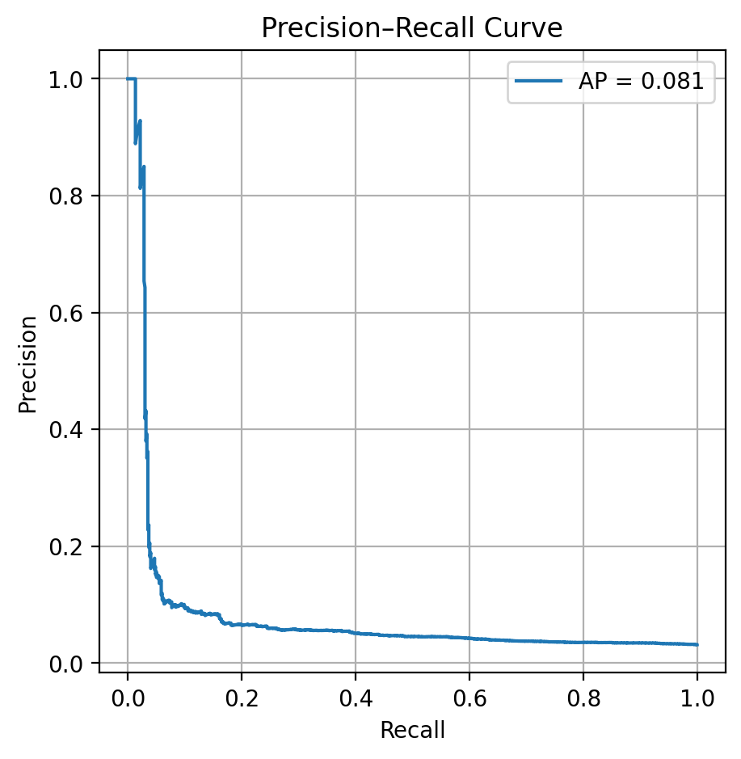

<h1>Olist Repeat Orders Technical Report</h1>

<h2>1. Project Objective</h2>

The goal of this project was to analyze repeat orders in the Olist marketplace, identify key factors influencing customer loyalty, and test potential improvements using simulations.

<h2>2. Data Overview</h2>

Data was obtained from the Brazilian E-Commerce dataset on Kaggle (<a href="https://www.kaggle.com/datasets/olistbr/brazilian-ecommerce" target="_blank">link</a>). It was aggregated from multiple tables to create a dataset suitable for predicting repeat orders. Key features include:

<ul>
    <li>Customer city</li>
    <li>Review score</li>
    <li>Product category</li>
    <li>Seller</li>
    <li>Delivery delay (difference from predicted delivery time)</li>
    <li>Order approval time</li>
    <li>Delivery time</li>
    <li>Target: repeat order (0/1)</li>
</ul>

Dataset snapshot:

<pre>
 #   Column                         Non-Null Count  Dtype  
---  ------                         --------------  -----  
 0   customer_unique_id             93356 non-null  object 
 1   order_id                       93356 non-null  object 
 2   customer_id                    93356 non-null  object 
 3   customer_city                  93356 non-null  object 
 4   repeat_order                   93356 non-null  int64  
 5   review_score                   92732 non-null  float64
 6   product_category_name_english  93326 non-null  object 
 7   n_sellers                      93326 non-null  float64
 8   first_seller                   93326 non-null  object 
 9   delay                          93356 non-null  float64
 10  approval_time_hours            93343 non-null  float64
 11  delivery_time_days             93356 non-null  float64
</pre>

<h2>3. Model</h2>

We trained a CatBoostClassifier on the first orders to predict repeat orders. CatBoost was chosen because of its ability to handle categorical features effectively and its robustness on relatively noisy data.

<h3>Feature Set</h3>
<ul>
    <li>Numerical: review_score, delay, approval_time_hours, delivery_time_days</li>
    <li>Categorical: customer_city, product_categories_first_order, first_seller</li>
</ul>

<h3>Evaluation</h3>

Due to strong class imbalance (3% repeat orders, 97% non-repeat), we prioritized precision for identifying repeat orders. The model metrics on the test set were:

<pre>
precision    recall  f1-score   support

0       0.97      1.00      0.98     18076
1       0.82      0.02      0.05       596
</pre>

<h3>Feature Importance</h3>

The most influential features were:

<ul>
    <li>Product categories of first order</li>
    <li>First seller</li>
    <li>Approval time</li>
    <li>Delivery delay</li>
    <li>Delivery time</li>
    <li>Customer city</li>
    <li>Review score</li>
</ul>

<h2>4. Simulation</h2>

To test actionable improvements, we simulated changes in operational metrics while keeping other features at observed levels. Two main scenarios were tested:

<ul>
    <li>Moderate improvements: approval time -50%, delivery time -10% → +9% predicted repeat orders</li>
    <li>Strong improvements: approval time -80%, delivery time -20%, review score → 4.5 → +218% predicted repeat orders</li>
</ul>

The simulation confirms that reducing approval time and slightly improving delivery can meaningfully increase repeat orders.

<h3>Precision–Recall Curve</h3>

The curve below illustrates model performance for identifying repeat orders in the presence of extreme class imbalance:

<h2>5. Limitations</h2>

The dataset, despite its large size, has a limited range of feature values, making it difficult for the model to predict extreme changes accurately. The severe class imbalance (3% vs 97%) also prevents achieving high F1-scores. As a result, predictions may not be as precise as they could be with a more balanced and diverse dataset.

<h2>6. Tools and Libraries</h2>
<ul>
    <li>Python 3</li>
    <li>Pandas, NumPy</li>
    <li>Matplotlib, Seaborn</li>
    <li>Scikit-learn</li>
    <li>CatBoost</li>
</ul>
